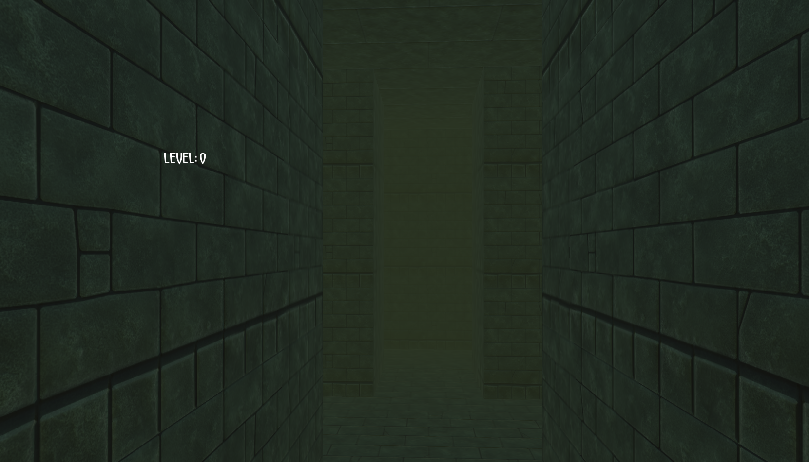
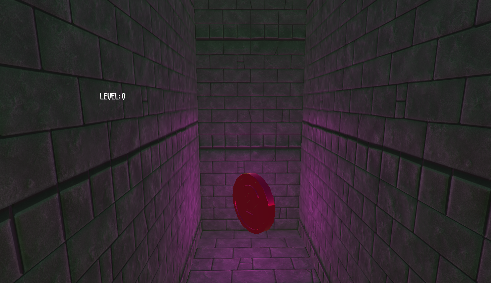

# Dread50

Get away from this dreadful maze as fast as you can. Run to find the purple coins and pass this level, but be careful not to fall!



## How to play

Playing with this one will be a peace of cake because it has been developed with Unity using scripts in C# ❤. Just follow this steps to start the game:

1. Open the git bash in your device and travel to the most convenient location to place the project. In my case, I would like to place it in my desktop:

```
cd desktop
```

2. Execute the clone command of git, and the folder with the project will be created and completely loaded in your current location (desktop in my case). So in the git bash I would execute the command:

```
git clone https://github.com/juliagarlor/Dread50.git
```

3. Now, open the new folder and choose the file Helicopter3d.exe. Once you double click, a new window will show up. Make sure the option Windowed is clicked, and choose your desired graphic quality. Finally, press Play! and let's see how far you can go with your treasure.



## Thanks ❤

Special thanks to the team of CS50 of Harvard University, without whom I wouldn't have been able to develop not only this project but my passion for videogames programming. 

Please, make sure to check the lecture to develop this project in the following link: https://youtu.be/BORUaRbwOaI

Regarding to this Helicopter3d version, any feedback for improvement is welcome, and I hope you have fun using it.

Developed with ❤ by Julia García
